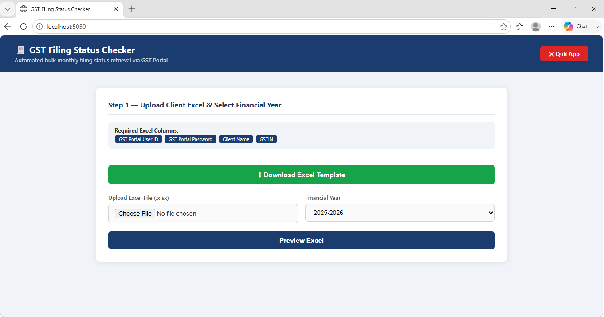
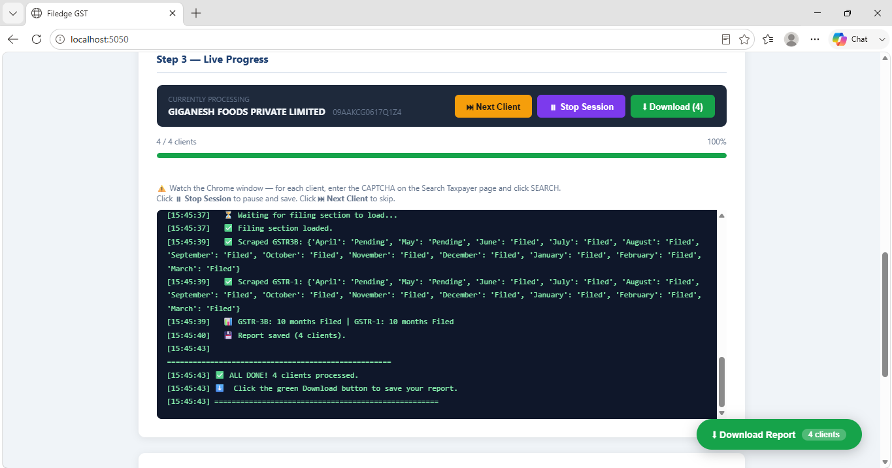
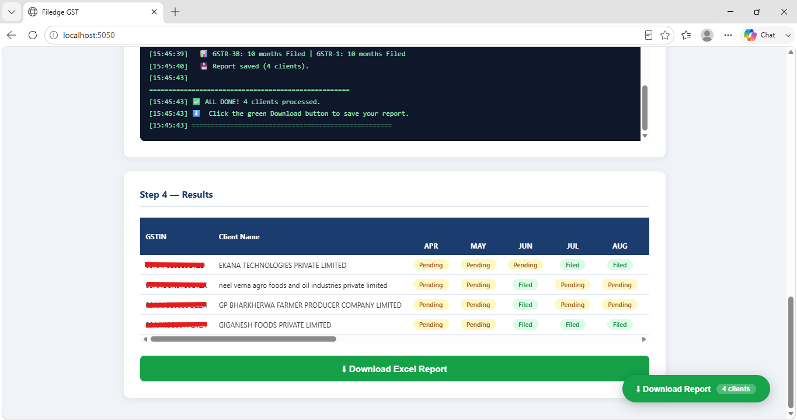
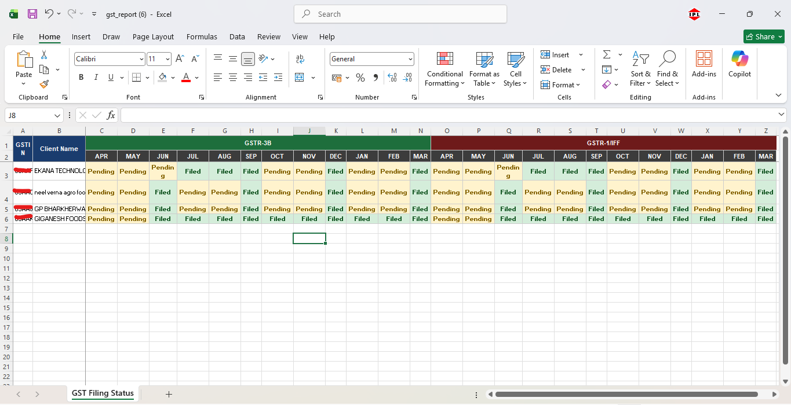

# Filedge GST

An automated GST filing status checker that uses Selenium to retrieve and track month-wise GSTR-3B and GSTR-1/IFF filing statuses for multiple clients.

## Overview

**Filedge GST** is a Python-based automation application designed to simplify the process of checking GST return filing statuses for multiple clients through the GST Portal.

The application accepts client details through an Excel file, automates the GST Portal using Selenium, retrieves month-wise filing information, and generates a structured Excel report containing the filing status of **GSTR-3B** and **GSTR-1/IFF**.

CAPTCHA verification is intentionally handled manually during the process.

The application also supports live progress tracking, skipping individual clients, stopping an active session, and resuming processing from where it was stopped.

---

## Features

- Upload client details through an Excel file
- Select the required Financial Year
- Preview uploaded client data before starting
- Automated GST Portal navigation using Selenium
- Manual CAPTCHA verification
- GSTIN-based taxpayer search
- Month-wise GSTR-3B filing status
- Month-wise GSTR-1/IFF filing status
- Live processing progress
- Skip individual clients
- Stop an active session
- Resume a previously stopped session
- Automatic saving of results after each client
- Downloadable Excel report
- Color-coded filing status in the generated report
- Automatic browser handling using WebDriver Manager

---

## How It Works

The application follows a four-step workflow:

### Step 1 — Upload Client Excel

Upload an Excel file containing the client information and select the required Financial Year.

### Step 2 — Preview Clients

The uploaded client data is displayed for verification before the automation begins.

### Step 3 — Start Automation

Filedge GST opens Chrome and navigates through the GST Portal using Selenium.

For each client:

1. The GSTIN is selected from the uploaded Excel file.
2. The taxpayer is searched on the GST Portal.
3. CAPTCHA verification is completed manually.
4. The filing status information is retrieved.
5. GSTR-3B and GSTR-1/IFF statuses are processed month-wise.
6. The result is saved automatically.

### Step 4 — View & Download Results

After processing, the results are displayed in the application and can be downloaded as an Excel report.

---

## Input Excel Format

The application accepts an Excel file containing client information.

The required column is:

| Column | Description |
|---|---|
| GSTIN | GST Identification Number |
| Client Name | Name or identifier of the client |

The application automatically detects the GSTIN and Client Name columns based on their column names.

A sample input template is provided in the repository:

`input_template.xlsx`

> **Important:** Do not upload real client information, GSTINs, passwords, or other confidential data to this public repository.

---

## Output

Filedge GST generates an Excel report named:

`gst_report.xlsx`

The report contains:

- GSTIN
- Client Name
- Financial Year
- Processing timestamp
- GSTR-3B filing status for each month
- GSTR-1/IFF filing status for each month
- Remarks

The filing status is organized according to the selected Financial Year, covering the months from **April to March**.

The generated report also uses visual formatting to distinguish different filing statuses.

---

## Pause & Resume

Filedge GST supports session persistence so that a long-running process does not necessarily have to start from the beginning after being stopped.

When a session is stopped, the application saves the current progress and creates a session file:

`gst_session.json`

The saved session can then be used to resume processing from the appropriate client.

This is particularly useful when processing a large number of clients.

---

## Client Controls

During automation, the application provides controls to manage the processing:

- **Next Client** — Skip the current client and continue with the next one.
- **Stop Session** — Stop the current automation session safely.
- **Resume** — Continue processing from a previously saved session.

The application also saves the report after each processed client to reduce the risk of losing completed results.

---

## Technology Stack

- **Python**
- **Flask**
- **Selenium**
- **Pandas**
- **OpenPyXL**
- **WebDriver Manager**
- **HTML**
- **CSS**
- **JavaScript**

---

## Project Structure

```text
Filedge-GST/
│
├── gst_checker.py
├── build_exe.bat
├── requirements.txt
├── input_template.xlsx
├── README.md
└── .gitignore
```

### Generated Files

The application may generate the following files during execution:

```text
gst_report.xlsx
gst_session.json
```

These files contain runtime/output data and should not be committed to the public repository.

---

## Installation

### Requirements

For running the Python version of the application:

- Windows
- Python 3.x
- Google Chrome
- Internet connection

### 1. Clone the Repository

```bash
git clone https://github.com/Anshika-Dubey/Filedge-GST.git
cd Filedge-GST
```

### 2. Install Dependencies

```bash
pip install -r requirements.txt
```

### 3. Run the Application

```bash
python gst_checker.py
```

The application starts locally and opens the Filedge GST interface in the browser.

The application uses port `5050` by default.

---

## Building the Windows Executable

Filedge GST can also be packaged as a standalone Windows executable using PyInstaller.

The repository includes:

`build_exe.bat`

To build the executable:

1. Install the required Python dependencies.
2. Keep the following files in the same folder:

```text
gst_checker.py
requirements.txt
build_exe.bat
```

3. Run:

```text
build_exe.bat
```

The build process generates:

```text
dist/
└── Filedge_GST.exe
```

The generated `Filedge_GST.exe` can be used without separately installing Python or the project's Python libraries.

---

## Running the Executable

For users running the compiled application:

1. Make sure **Google Chrome** is installed.
2. Ensure an active internet connection is available.
3. Place `Filedge_GST.exe` in its own folder.
4. Double-click the executable.
5. The application opens its local web interface automatically.
6. Upload the client Excel file.
7. Select the Financial Year.
8. Preview the uploaded data.
9. Start the automation.
10. Complete CAPTCHA verification manually whenever prompted.

The generated report and session file are saved alongside the executable.

---

## CAPTCHA Handling

CAPTCHA verification is intentionally **not automated**.

The application pauses at the CAPTCHA stage and requires the user to enter the CAPTCHA manually before continuing.

This project does not attempt to bypass CAPTCHA verification.

---

## Screenshots

Screenshots of the application interface and generated reports will be added here.

### Dashboard



### Processing



### Results



### Generated Excel Report



---

## Important Notes

- Google Chrome is required for Selenium-based browser automation.
- An internet connection is required to access the GST Portal.
- CAPTCHA verification must be completed manually.
- GST Portal credentials and client information should be handled securely.
- Do not commit confidential client data or generated reports to the repository.
- Changes to the GST Portal interface may require updates to the Selenium automation logic.
- The application is intended for authorized use only.

---

## Disclaimer

Filedge GST is an automation tool intended to assist with GST filing-status checking.

Users are responsible for ensuring that their use of the application is authorized and complies with applicable GST Portal requirements, organizational policies, and data-security practices.

The project does not bypass CAPTCHA verification and does not guarantee uninterrupted operation if the GST Portal changes its interface or functionality.

---

## License

This project is licensed under the MIT License.
